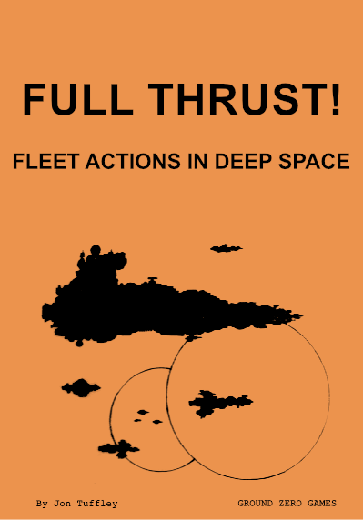

---
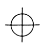
TO: NAVAL COMMONWEALTH NAVAL, COMMAND.
FROM: HMS FURIOUS EC-1406, ASSIGNED SYSTEM DEFENCE, CANES VENATICI.
MESSAGE BEGINS ••••••••••

> This is Captain Alexander van der Meij, commanding His Majesty’s Escort Cruiser “Furious”. At 13:04:12:32 GST, one of our far-orbit sensors detected energy diffusion effects characteristic of a large task force of naval units dropping out of FTL drive on the limits of the Venatici system. All attempts to communicate with the intruders have proved negative, and there is no response to IFF; given the current state of relations with Eurasian Union forces we have no option but to classify the unknowns as hostiles and take appropriate measures to defend the Venatici colony.

> To this end I have ordered the Lancer Boats HMS Vampire (L-3517) and Venom (CL-3522) to assume low orbit around the colony to provide final defence, while Furious and our accompanying Destroyer HMS Zumwalt (DD-2004) proceed to engage the enemy units. HMS Valiant (L-3538) has been ordered to make all speed outsystem to Freya with this message, plus all accompanying sensor downloads.

> Latest long-range scan intelligence indicates a minimum of twelve hostiles inbound, with high probability of at least two Capital units. Three more contacts are exhibiting signatures of heavy transport craft, so we can only assume this to be a landing force. Our duty therefore is to attempt to inflict as much damage on this taskforce as possible before they reach planetary orbit. TacComp predictions of the survival chances of Furious and Zumwalt in our optimum attack pattern are approximately 2.4% and 1.7%; accordingly we expect this to be our last transmission.

> Estimated time to firm sensor contact: 2.1 hours. Time to engagement: 2.8 hours. We are proceeding to engage at full drive. May God be with us.

MESSAGE ENDS •••• SENSOR DOWNLOAD FOLLOWS.

This rulebook is the culmination of nearly eighteen years of development. This may sound a bit of an exaggeration, but the basis of the rules were actually written in 1973, at the same time that Skytrex Ltd. released the first ever miniature Starships suitable for wargaming; large fleet actions on the tabletop. Since those distant beginnings, the rules have evolved through many forms and stages, with new ideas being added, tested and discarded; this end result is very different in detail from the earliest set, but in concept is very much the same – a set of simple, straightforward rules that enable players to handle LARGE fleets of ships (a dozen or more per side is no problem) while still playing in a reasonable time. Few players regularly have more than a few hours to devote to a single game session, especially on Club nights and similar, so the intention was for a game that can be played within this sort of timespan and actually FINISHED, ie: not having to end the game after three turns and assess victory points because it is closing time!!

The sections of the rules titled “BASIC GAME” can be used alone to provide a very fast-play game with any size of fleet, with no complications. The “ADVANCED GAME” rules are all modular “bits” that can be added to the basics to increase the level of detail and complexity, particularly when using smaller forces. Note that it is not necessary to use ALL the advanced rules – just pick and choose the ones you want (but agree which with your opponent first!); even with all the options in use the game is still far from complicated, but this is deliberate – the aim is to HAVE FUN, not get lost in fifty pages of rules trying to find sub-clause B:2 to rule number 76.2, special case 5 •••••••

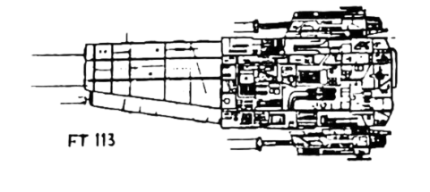
# BACKGROUND:

As, with all our rules systems, this is a GENERIC one that can be used with any background or future history that the players desire. There are several epic space battles that come to mind from SF literature and films from the mind-boggling fleet actions of “Doc” Smith’s “Lensman” saga up to more modern works such as H. John Harrison’s “The Centauri Device” (with its wonderful three-way battle between the Israeli World Covenant, the Union of Arab Socialist Republics and the Interstellar Anarchists!!) and of course the huge Capital-ship battle at the climax of “Return of the Jedi”.

Most players will be able to think of many other examples, and probably have their own favourites; the rules provide you with a framework onto which you can hang all the background detail you wish.

# EQUIPMENT:

The only items necessary for play are a suitable tabletop or similar flat area, ship models or counters, a tape measure and a number of normal 6-sided dice (D6). Other items may be used if desired to make the game more visually attractive or faster to play, such as a “turning gauge” for easy course reckoning and reading fire arcs, “Bogey” markers for unidentified ships etc; details of these items are given in the relevant sections of the rules.

Players will also need copies of the Ship Record Chart included with these rules, which may be photocopied as necessary for personal use.

# PLAYING AREA:

One of the great advantages of Starship combat games is that you do not need any “terrain”: Any flat area (floor or tabletop) will suffice for a game – if you are using a very small area, simply reduce all scales and ranges accordingly (eg: use centimetres for all distances instead of inches).

For maximum visual appeal, obtain a large piece of black cloth or paper to cover the playing area and speckle it with dots of white and yellow paint in varying sizes – the resulting “starfield” is surprisingly effective!

# SEQUENCE OF PLAY – BASIC RULES:

In the basic game, players start off by writing Movement orders for all their ships; both forces are then moved in accordance with the orders. All firing is then carried out by both sides: note that it does not matter who “fires first”, as no damage takes effect until all firing is completed.

Finally any destroyed ships (those down to zero Damage Points) are removed, and the next turn begins.

# SHIP CLASSES:

Ships are referred to under the rules by common Naval titles (Frigates, Cruisers, Battleships etc) as this will be simple for most players to relate to, and is also the terminology used in much of the SF media. If you want to give the classes more exotic names, feel free to do so!

For ease of play a table of basic ship types is included, listing weaponry and capabilities for typical examples of each major class. If desired, ships can be “customised” by varying the ratings given, and guidelines for this are given in the advanced rules.

Note that if you are using commercial model ships, just because a manufacturer happens to classify a particular model in his range as a “Destroyer”, this in no way prevents you calling it a Cruiser, or anything else that fits in with your fleet structure!

# TABLE OF BASIC SHIP CLASSES

| CLASS       | THRUST | DAMAGE | WEAPONS | FIRECON |
|:----------------|:------:|:-------:|:--------|:---:|
| SCOUT / COURIER | 8 | 2 | 1xC (all round fire) | 1 |
| LANCER / CORVETTE | 8 | 4 | 1xB (all round fire) | 1 |
| FRIGATE   | 6      | 6       | 1xB (F,P,S) 1xC (P,S,A) |1|
| DESTROYER | 6      | 8       | 2xB (F,P,S) 1xC (P,S,A) |1|
| LIGHT CRUISER | 6      | 12      | 1xA (F,P,S) 1xB (F,P,A) 1xB (F,S,A) |2|
| ESCORT CRUISER | 6      | 14      | 1xA (F,P,S) 2xB (F,P,A) 2xB (F,S,A) |2|
| HEAVY CRUISER | 4      | 18      | 1xA (F,P) 1xA (F,S) 2xB (F,P,A) 2xB (F,S,A) |2|
| BATTLESHIP | 4      | 22      | 2xA (F,P); 2xA (F,S); 2xB (F,P,A); 2xB (F,S,A) |3|
| DREADNOUGHT | 2      | 28      | 3xA (F) 2xA (F,P) 2xA (F,S) 4xB (P,S,A) |3|
| CARRIER   | 2      | 24      | 2xB (F,P,S) 1xB (P,A) 1xB (S,A) |3|

Notes on table: DAMAGE – number of Damage Points ship can sustain before being destroyed. FIRECON – number of targets ship can engage in one firing turn.

WEAPONS: Example: 2xA (F,P,S) – two “A” (Primary) batteries, each bearing through three arcs – Fore, Port and Starboard.

# WEAPON SYSTEMS:

The basic game uses only Beam Weapons, other types being discussed in the optional advanced rules. The term “Beam” is a generic one, and may be assumed to represent any form of energy weapon the players desire – Lasers, Phasers, Particle Beams or Blasters!

There are three classes of Beam weapon batteries available: Primary (A class), Secondary (B class) and Tertiary (C class). Each battery fitted to a ship is denoted on the ship diagram by a circle containing the battery type, surrounded by one or more lines indicating the fire arcs through which that particular weapon battery will bear. Thus a Primary (A) battery bearing through Port, Fore and Starboard arcs would be marked as: while a Tertiary (C) battery bearing Aft only would be: 

Each battery on a ship can fire independently, but note that the total number of different targets an individual ship may engage in one turn is limited by the ship class. Each battery may fire once only per turn, through any **one** of its eligible fire arcs.

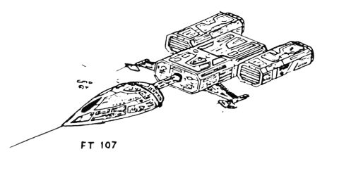
# BEAM WEAPONS RANGE AND FIRE:

The basic game uses only Beam Weapons, other types being discussed in the optional advanced rules. The term “Beam” is a generic one, and may be assumed to represent any form of energy weapon the players desire – Lasers, Phasers, Particle Beams or Blasters!

There are three classes of Beam weapon batteries available: Primary (A class), Secondary (B class) and Tertiary (C class). Each battery fitted to a ship is denoted on the ship diagram by a circle containing the battery type, surrounded by one or more lines indicating the fire arcs through which that particular weapon battery will bear. Thus a Primary (A) battery bearing through Port, Fore and Starboard arcs would be marked as ○A with three arc lines, while a Tertiary (C) battery bearing Aft only would be marked accordingly.

Each battery on a ship can fire independently, but note that the total number of different targets an individual ship may engage in one turn is limited by the ship class. Each battery may fire once only per turn, through any of its eligible fire arcs.

The number of dice rolled, ranges and effects are as follows:

PRIMARY batteries have a range of 36"; at 0–12" each battery has THREE dice for hits; at 12–24" it has TWO dice and at 24–36" ONE die only.

SECONDARY batteries have a range of 24", using TWO dice at 0–12" and ONE die at 12–24" range.

TERTIARY batteries have a range of 12" only, and use ONE die up to this maximum.

For every die rolled, damage is inflicted on the target ship as follows:

1, 2 or 3  – NO EFFECT (a miss or insignificant damage). 4 or 5     – ONE DAMAGE POINT inflicted on target. 6          – TWO DAMAGE POINTS inflicted on target.

Example: A ship fires at an enemy at a range of 18"; the firing ship can bring two batteries to bear on the arc containing the target, one Primary and one Secondary (whether there are any Tertiary guns covering the same arc is irrelevant, since they are out of range). The Primary battery has a firepower of 2 dice at 12–24", the Secondary one die only; thus the total firepower is THREE dice. Rolling the three D6, the firing player scores 1, 6 and 5 – this inflicts a total of THREE damage points on the target ship (1 is a miss, 6 = 2 Damage, 5 = 1 Damage).

ALL WEAPONS FIRE IN THE BASIC GAME USE THIS SIMPLE SYSTEM.

# FIRING ARCS:

The 360 degree space around a ship is divided into four equal (90 degree) arcs, denoted FORE, PORT, STARBOARD AND AFT. All weapon systems carried by the ship must be defined as covering one or more of these arcs, subject to the rule that arcs covered by a single weapon battery must be adjacent – ie: a battery could fire through Fore and Port arcs, but NOT through Fore and Aft.

Primary (A) and Secondary (B) batteries may cover up to THREE adjacent fire arcs, whereas Tertiary (C) batteries may, if required, give all-round coverage through all four arcs.

All lines of fire are judged from the centre of the firing ship model (or centre of its base) to the corresponding centre of the target. Note that any given target ship may only be in ONE firing arc of the attacking ship – if it is visually impossible to determine which arc, decide by a random D6 roll.

ALL FIRING RANGES AND MOVEMENT DISTANCES ARE SIMILARLY DETERMINED FROM THE **CENTRE** OF THE SHIP MODEL.

# FIRE CONTROL SYSTEMS:

Each ship class is equipped with one or more Fire Control (FIRECON) systems, representing the sensor suites and computer facilities for directing weapons fire. In general terms, Escort craft (those up to Destroyer class) carry ONE Firecon system, Cruisers carry TWO and Capital Ships have THREE, as noted in the Ship Class Table.

Each Firecon system allows the ship to engage ONE target during a firing turn. Thus, for instance, a Heavy Cruiser can engage up to TWO separate enemy ships each turn, splitting fire from its weaponry as desired (noting, however, that each individual BATTERY can engage one target only – a single gun battery can neither split its dice rolls between targets, nor split fire between different arcs). If more than one target is engaged by a ship using two or more Firecon systems, the targets MUST be in different fire arcs.

Example: A Light Cruiser has one target in its Fore arc, and another in its Port arc; using its two Firecon systems, it can engage both. The player decides to engage the Fore target with the “A” battery and the starboard-mounted “B” battery (as this cannot bear into the Port arc, but can fire forward) and use just the Port-side “B” battery against the target in the Port arc.

# DAMAGE EFFECTS:

Damage inflicted from weapons fire is marked off on the ship’s record chart, but does not take effect until the end of the turn – all firing is considered simultaneous (ie: destroyed ships are not removed until all firing is completed, so units that have not yet fired in that turn still get to do so before being removed).

There is no system in the basic game for reducing a ship’s capabilities as it suffers damage; a ship may still fight at full strength until it is actually reduced to zero points and destroyed. Rules for gradual reduction of ships’ abilities with damage are found in the advanced game section if desired.

# MOVEMENT OF SHIPS:

The movement of any ship in a given turn is defined by two factors: COURSE and VELOCITY. The course of a ship is given in terms of a number from 1 to 12, using a clock-face method; course 12 is defined at the start of the game as being a certain direction (usually the centre of one side of the playing area) and all courses are then worked out from this reference point.

Example: If course 12 is towards the “North” edge of the table, then course 3 will be due “East”, course 6 “South” and course 9 “West”. BOTH fleets use the same set of course references for all movement.

A ship’s VELOCITY is the number of inches it will move in that turn, in the direction of its current Course. This is recorded from turn to turn, and may only be altered by the application of thrust for acceleration or deceleration.

Each ship has a THRUST rating, indicating the output of its Drives relative to the mass of the ship. This thrust is used to change velocity and/or course as necessary, according to the movement orders noted for each ship at the start of the turn. The Thrust Rating of any ship is the TOTAL amount (maximum) of power it may use to alter course and velocity in any one turn, subject to the following limitations:

ANY OR ALL of the available Thrust may be applied to ACCELERATE or DECELERATE the ship, but only a maximum of HALF the Thrust rating may be applied to COURSE CHANGES each turn. (Eg: a ship with Thrust of 4 can only apply 2 points of thrust to course changes, leaving 2 points to be used for Velocity changes; it could, however, apply 4 points to Velocity and not alter course, or, say, accelerate 3 points and turn just 1 point).

EACH POINT OF THRUST ALLOCATED TO VELOCITY CHANGE WILL ACCELERATE OR DECELERATE THE SHIP BY 1"; EACH THRUST POINT APPLIED TO COURSE CHANGES WILL ALTER THE SHIP’S COURSE BY ONE COURSE NUMBER (ie: a 30 degree turn).

Example: A ship with an available thrust of 6 is travelling (in its last move) at a velocity of 14", on a course of 7. The player wishes to accelerate and turn the ship to Starboard, so decides on using 2 points of course change and the remaining 4 on velocity; this means the ship will move at a velocity of 18" (14 + 4), on a course of 9 (original course of 7, + 2 = 9).

NOTE that STARBOARD turns rotate the ship CLOCKWISE, so all Starboard course changes are POSITIVE (ie: added to previous course number). Conversely, all PORT turns are ANTICLOCKWISE, so SUBTRACT from the previous course.

In basic game terms all course changes are made by rotating the ship model to its new course at the start of its move. A slightly more “authentic” system of manoeuvre is detailed in the advanced rules.

IMPORTANT NOTE! Ships have NO maximum speed limit; they may continue to accelerate each turn if they so wish, and will maintain any velocity reached until they apply thrust to decelerate. Note, however, the rule on “Ships leaving the table” before trying to go TOO fast!

# MOVEMENT ORDERS:

The Ship Record Chart has a series of boxes for writing each turn’s movement orders for each ship. At the start of the turn, each player must write orders for each of his ships that he wishes to apply thrust; if he wishes the ship simply to move ahead at its current speed, no orders are necessary (any ship with no orders will move straight ahead at unchanged speed, as will any that are given impossible orders – ones that exceed the ship’s thrust rating).

The actual orders are written in short notation, giving course change (if any) and direction (Port or Starboard), plus any Acceleration (as +) or Deceleration (as –). The new final velocity is then written in the small box after the order box, as reference for next turn. Eg: an order of P2, +4 would indicate a two-point turn to Port (P), plus acceleration of 4". If (say) the ship had been travelling at velocity 8 last turn, the new total velocity of 12 (8 + 4) would be written in the velocity box to give the starting velocity for the next move.

# SHIPS LEAVING THE TABLE:

As there is no MAXIMUM speed for any ship (they can theoretically keep accelerating each turn without limit), it is possible that sometimes a ship may find it impossible to turn enough to avoid flying off the playing area. If this occurs, roll 1 die: on a roll of 1, 2 or 3, the ship may NOT return to play during the game; a roll of 4, 5 or 6 indicates the ship may re-enter the table after the equivalent number of turns have elapsed (eg: 5 turns if a 5 is rolled). Ships will always re-enter play from the same side of the playing area as they left, though the actual point of entry is up to the player.

# THE SHIP RECORD CHART:

The chart included in these rules should be photocopied enough times to give each player sufficient room for all his ships. To enter a ship’s details on the chart, first write the ship I.D. (whatever mark or number is on the model to identify it), and name the craft – naming individual ships gives a much better sense of identifying with your forces rather than just calling a model “Frigate No.3”, and thinking up suitable names is an interesting pastime in itself!

Enter the CLASS of ship in the relevant box, then fill out the Ship Diagram with the systems the ship carries. Symbols for Beam batteries are described in the weapons rules; Drives are denoted by a triangle with the Thrust Rating, thus: . If using the optional weapons from the advanced rules, Pulse Torpedo tubes are marked with the symbol and Needle beams with .

Mark each Firecon system with a symbol.

Now fill out the Damage section by blanking out all boxes except the number for the ship’s damage value; if using the advanced rule for specific damage, leave an equal number of blank boxes on each line so that reaching the end of a line indicates the “threshold point” for special damage. As normal damage occurs cross off boxes of damage, while specific damage is noted by crossing out the relevant system on the diagram. Any other details (fighters carried, Bogey I.D. etc) can be added in the NOTES section, while the rest of the chart is used for each turn’s order writing.

# EXAMPLE OF RECORD CHART:

Below is one line of the record sheet, filled out for a sample ship from the basic ship class table; the sheet is depicted after several turns of play, after the ship has taken some damage.

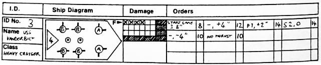
#  Advanced Rules 

# SEQUENCE OF PLAY – ADVANCED RULES:

This is as for the Basic game, except for a few points. Movement orders and movement are conducted exactly as for the basic rules; then players decide whether to make any Active sensor scans, and any ships thus revealed are placed on the table (as are any revealed by coming within Passive scan range). Any Fighters in play are now moved.

Weapons fire may be carried out simultaneously as for the basic rules, or if desired may be alternated between players (the player with the most ships fires one ship of his choice, then his opponent fires one, and so on) until all ships have been fired or neither player wishes to fire any more. In this case, any damage inflicted takes effect IMMEDIATELY, without giving the enemy ship a chance to fire back. Use of this rule brings a lot more tactical thought into fire of ships: do you fire a damaged ship first to ensure it gets its shot off before being destroyed, or do you use your heaviest ships first in the hope of doing maximum damage?

NOTE that each ship must fire all of its weaponry that it desires to use at the one time; it may not fire again later in the turn.

# ADVANCED MOVEMENT:

The only alteration to the basic game movement system is to do with turning ships. In this advanced rule, ships do NOT make their full ordered Course Change at the START of their movement. If they are turning just ONE course point, they are moved HALF their velocity straight ahead, THEN turned to the new course and moved the other half of their movement; if they are turning through TWO or more course points, then they make HALF of the course change (rounded DOWN if total course change is an odd number) at the start of the move, move half distance on this course, then turn the remaining course points and complete the movement.

This rule has the effect of making ships move in more of an approximation of a curve, rather than sudden angular movement, and makes players think rather more carefully about where the ship will end up when writing their orders!

Example: A ship is moving at velocity 12", and is travelling on course 3. It is ordered to turn 2 points to Starboard, bringing it round to course 5; the ship begins its move by turning to course 4 (half its full change), moves 6" on course 4, pivots again to course 5 and then moves its remaining 6". (Had it been turning THREE course points, the ship would have first turned to course 4 as above, then turned the remaining 2 points to course 6 at the midway point of its move).

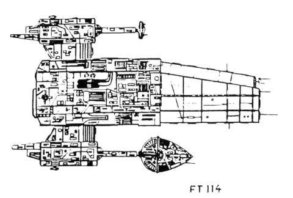

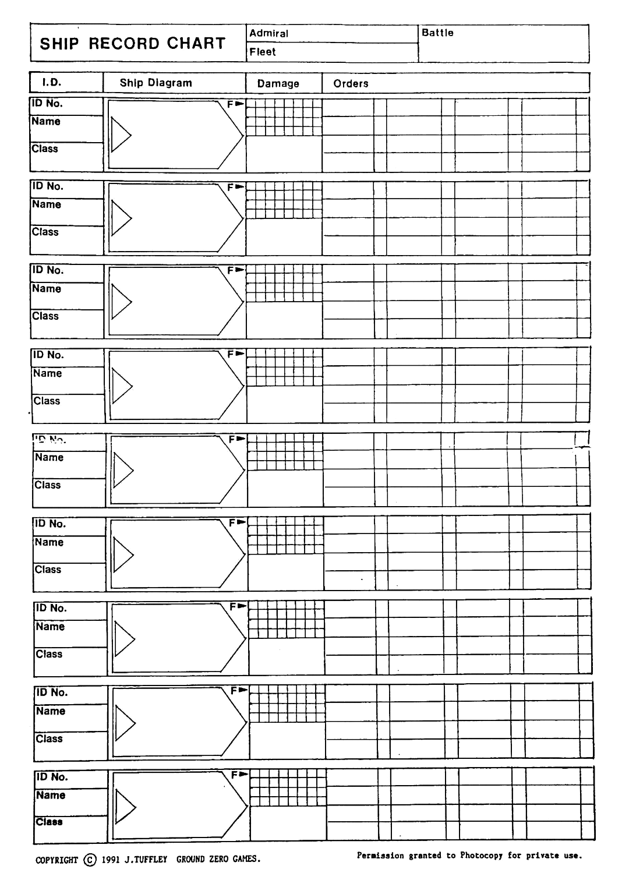
# SPECIFIC DAMAGE:

In the Basic rules, any ship could continue to fight at full strength until actually destroyed, regardless of damage sustained. This is obviously a vast over-simplification, and if more accuracy is desired the following procedure may be used.

Rather than burden the game with endless “critical hit” rolls and tables, we simply define “Threshold points” of damage sustained at which the possibility of extra specific systems damage may occur.

For Escort classes (up to Destroyers) the Threshold point is at HALF of the total damage a ship can take; for Cruisers there are two points, at 1/3 and 2/3 damage; and for Capital ships there are three: 1/4, 1/2 and 3/4 damage. When a ship sustains damage that takes it to or past one of these points, the owning player must roll ONCE for EACH system still functioning on the ship, to see if it remains operational or is knocked-out.

Roll a D6 for each Weapon battery, for the Drives and for each Firecon.

For Escorts the system rolled for is lost on a roll of 4, 5 or 6.

For Cruisers the effective roll is 6 at the first point (1/3 damage), and 4, 5 or 6 at the second point (2/3 damage).

For Capital ships the first point (1/4) requires a 6, the second (1/2) a 5 or 6, and the third (3/4) a 4, 5 or 6.

Any systems damaged in this way are crossed off the Ship Diagram on the record chart, and may no longer be used; the exception is the Drive, which is reduced to HALF its Thrust Rating the first time it is damaged, and completely disabled on the second hit.

Example: A Destroyer is reduced to 4 damage points left (half its original 8) so has reached its Threshold point and must dice for damage to each system. The player rolls a 5 for one “B” battery (thus losing it), but the other “B” survives with a roll of 2, as does the “C” battery with a roll of 3. The Drives get a 6, being reduced to half thrust, while the Firecon survives with a 1 roll. Thus the ship is left able to manoeuvre (just), and still able to fight with its two remaining weapons.

# SENSORS AND TARGET IDENTIFICATION:

This rule allows a basic form of “limited intelligence” to be brought into the game, and makes the initial fleet dispositions much more interesting.

When the fleets enter the table, all ships are represented not by their actual models or counters, but by “Bogey” markers. These can be simple counters of card or plastic, or for best visual effect a black-painted Ping-Pong ball mounted on a stand is ideal. Each “Bogey” is marked with an identifying letter or number, which the owning player secretly notes as representing a certain ship.

During the initial turns of play, the Bogeys are moved exactly as for the ships they represent, using the normal orders system (players must ensure they do not write orders for Bogey movement that exceed the capabilities of the ship itself). Whenever two opposing Bogey markers come within 36" of each other, BOTH are removed and replaced by the actual ships – this is the effective range of “Passive Sensors” to accurately identify a target contact (the Bogey itself represents a long-range sensor contact of undefined class).

If a player wishes to try and identify enemy units at greater than this 36" range, he may choose to have one or more of his own ships make an ACTIVE SENSOR scan; this reveals the identity of the scanned Bogey, but also “illuminates” and reveals the SCANNING ship (it is assumed that as soon as a ship commits its Active Sensors their signature will identify it to enemy vessels). 

One ship may scan one Bogey in each turn, regardless of class of either vessel involved, at a range of up to 54".

To add extra confusion to the game, players may (if agreed) deploy “dummy” Bogey markers, representing Drones equipped to emit the same sensor signature as a warship. Dummy markers are removed from play when they are scanned (Passively or Actively), but until then move as a normal ship, having the manoeuvre ability of a Scout/Courier.

# HULL ARMOUR:

Under the hit procedure used in the basic game all ships have the same chance of suffering damage from weapon hits. This rule allows for heavier ship classes to be more resistant to hit effects, through hull armour, defensive screens or whatever.

For all Escort classes (Destroyers and smaller), use the normal damage system of 4 or 5 = 1 point damage, 6 = 2 points.

For Cruiser classes, use 1, 2 or 3 = NO effect, 4 or 5 = 1 point damage, 6 = 2 points.

For Capital ships, count rolls of 1 to 5 as NO effect, and 6 = 1 point only.

Use of this rule changes play balance considerably, and also has a great effect on tactics; it makes larger ships much more resistant to damage, and makes it less easy for a swarm of smaller craft to overcome a few larger ones. The best tactics to use in this case is to use the lighter ships to engage the enemy’s own light screening forces, leaving the Heavyweights to slog it out between themselves.

# FIGHTERS:

Some Warships are equipped to carry groups of Fighters, small combat craft not FTL-capable in themselves. Specialised Carriers may carry up to 18 fighters while Dreadnoughts may have up to 6; no other classes may carry fighters.

All fighters operate in GROUPS of 1–6 craft, the group moving and firing as a single unit. As hits are scored on the group, individual fighters are removed. It is recommended that a group is represented by a single base (eg: a 2" square of clear plastic) with the required number of fighter models (or counters) placed on it, perhaps attached with Blu-tack or similar for easy removal.

Fighter groups do not need movement orders; on each turn, they may move up to 18" in any direction, regardless of how they moved in the previous turn. All Fighters are moved AFTER the movement of all major ships, with players moving one group alternately until all have been moved.

Fighter groups may be launched from a Carrier or mother-ship in any turn, but to do so the Carrier must NOT make any Course Changes OR velocity changes that turn. The Fighter group is launched at the Halfway point of the Carrier’s movement; the launching should be noted in the Carrier’s orders for that turn. A specialised Carrier can launch up to TWO fighter groups per turn (12 fighters), other ships one group only.

Fighter recovery is similar to launching; the Carrier must travel on a straight course at constant speed for one turn, the Fighter group being moved to the Carrier at the end of the turn. Only ONE group may be RECOVERED by any ship per turn, including specialised Carriers. FIGHTERS MAY ONLY BE LAUNCHED AND RECOVERED ONCE EACH during the game – once back aboard their Carrier they may not be launched again in that action.

Fighters have an attack range of 6", firing through the Fore arc of their base only. All fighters in the same group must engage the same target. Roll 1 die per fighter attacking, hits being scored just as for all other attack die rolls.

# ANTI-FIGHTER WEAPONRY:

All Warships are equipped with a number of short-range turrets for use against fighters, similar to contemporary AA guns (they are of no use against other major ships). Anti-fighter weapons have a range of 6". Each ship is equipped with AF guns equal to its number of Firecon systems, ie: Escorts 1 system, Cruisers 2 and Capital units 3.

Each AF system allows one die roll against any attacking fighter group; note that ships can only fire on fighters actually attacking that ship, and may not engage groups attacking other ships, even if within the 6" range.

For every AF die rolled, count results as for a normal damage roll: 4 or 5 = one fighter removed, 6 = two fighters hit.

All AF fire is carried out BEFORE the fighter attack is resolved, and fighters lost may NOT then attack. 

Note that loss of Firecon systems due to damage also indicates loss of AF weapons.

# OTHER WEAPON SYSTEMS:

Many types of weapons can be introduced to the game other than just the Beams used in the basic rules, and players are free to invent new ones, providing their opponents agree! Two examples are given below:

**PULSE TORPEDOES:** Heavy, short range energy discharge weapons firing "bolts" of plasma. Range 18"; roll 1 die per shot, needing 4,5,6 to hit up to 6", 5,6 to 12", 6 only at up to 18". If the shot hits, then roll another die to determine damage: the number rolled is the Damage points inflicted (ie: roll of 5 = 5 damage points!).

Torpedo launchers may be carried by Cruisers and Capital Ships only, and replace 3 factors of Beam weapons per torpedo launcher (ie: one "A" battery must be lost to fit one torpedo tube). Torpedoes may be fired through the Fore arc only.

**NEEDLE BEAMS:** Short-range, highly-focused energy beams with very accurate targeting capability. Range is only 9", but the firing player may use this weapon to attempt to hit a SPECIFIC SYSTEM on the target ship (eg: a gun battery, Firecon, Drives etc.). Nominate the intended target system and roll 1 die per Needle firing: on a roll of 5 or 6 that system is hit and knocked out (other scores have no effect). NOTE: Drive hits do not immediately destroy the system – the first hit reduces the drive to HALF its original thrust, the SECOND hit disables it outright.

Needle weapons may be fitted to any ship in place of one factor of Beam weaponry. Needle batteries may fire through ONE arc only (ie: a Port-firing Needle may fire to Port only, not through any other arcs).

# COLLISIONS AND RAMMING:

The distances represented in the game are actually so vast that the risk of an actual accidental collision is incalculably small, and is ignored for game purposes; if two ships touch at the end of a move, simply arrange them as closely as possible to the agreement of both players.

However, in some circumstances it may be possible for one ship to deliberately ram another, or at least try to. To accomplish this, the "ramming" player must have planned his move so that the ships end up within 2" at the end of the turn (or models in contact, if they are larger). Should he succeed in this (difficult enough in itself, unless he has very accurately anticipated his opponent's moves) then both players roll a D6 and add the Thrust Rating of their ship; if the ramming player's total is higher he has succeeded in ramming the enemy ship, if it is equal or lower then the enemy has evaded the attempt.

To assess damage from a ramming, roll 2 D6 and multiply the result by the Firecon number of the ramming craft (eg: for a Cruiser class, x2); BOTH ships suffer damage equal to the result (this will more than likely destroy all but the heaviest or luckiest craft!).

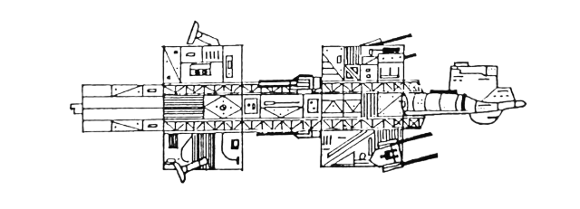

IMPERIAL SUPER-DREADNOUGHT (Skytrex STARGUARD range, illustration courtesy Skytrex Ltd.)

# ALTERING SHIP DESIGNS:

The basic ship classes given in the data table may be modified to provide a different mix of weaponry and performance by exchanging systems on a points basis. Beam weapons are costed by Factors, with an "A" battery costing 3 factors, a "B" 2 and a "C" 1. Damage points are costed by one factor per point, and may be traded for weaponry of similar points value subject to the following limitations: Damage values may not be increased or decreased to within less than 1 point of the next highest or lowest ship class; ie: a Battleship could not have its damage value reduced below 19 as this would bring it into Heavy Cruiser class, or above 27 as this would make it a Dreadnought!

Example: a Destroyer could trade-in its "C" battery for one extra Damage point (bringing it to Damage of 9), or could lose one damage point (down to 7) AND its "C" battery, to add an extra "B" battery (2 factors).

Note that the arcs of fire of a battery do not count towards its cost, just the battery strength. New batteries added should be distributed between fire arcs in a reasonable manner, using the basic ship types as a guide.

Drive Thrust values may NOT be altered; these are fixed for the various classes. Firecon systems may similarly NOT be traded for other systems.

# FREIGHTERS AND MERCHANT CRAFT:

Some scenarios may call for Freight ships, Liners and other Merchantmen, or for Fleet Auxiliaries such as Depot ships, Tenders etc. These function as for Warships, except they are very lightly armed (often unarmed, in the case of Civil ships) and generally have low Thrust levels: they do, however have fairly high Damage ratings due to their bulk.

A few typical classes are listed here, but players are free to design their own:

| CLASS            | THRUST | DAMAGE | WEAPONS                  | FIRECON |
| :--------------- | :----: | :----: | :----------------------- | :-----: |
| LIGHT FREIGHTER  |   4    |   10   | 1xC (all round fire)     |    1    |
| BULK CARRIER     |   2    |   26   | 1xC (all round) or none. |   1/0   |
| COMMERCIAL LINER |   4    |   18   | None                     |    0    |
| FLEET TENDER     |   2    |   24   | 1xB (F,P,S) 1xC (P,S,A)  |    1    |

If using the optional Armour rule, all merchant ships have hulls as per Escorts.

# MORALE:

This is a tricky subject for a simple rules system – to be in any way realistic, morale rules generally end up being very complex and time-consuming to use. For basic games it is suggested that morale is generally ignored, as it does not have a very great bearing on Fleet actions anyway. If a system is desired for use in advanced game, the following will give reasonable results without TOO much extra dice-rolling and calculation.

When a player's fleet (or a Squadron if large forces are sub-divided thus) reaches 50% losses or more (in actual numbers of ships, not points values), there is a chance that it will attempt to break off and withdraw; roll 1 D6: a roll of 6 indicates that the unit or Fleet will disengage and attempt to retreat off-table, or to join with the main force in the case of a squadron or similar sub-unit. If this first test is passed, test again each time a further ship is lost, reducing the needed roll by one. eg: if two more ships are lost then a roll of 4,5 or 6 will cause a retreat.

Many special cases can be added to this rule if desired: loss of the Fleet Flagship (which must be nominated at the start of the game) might cause the force to test morale regardless of other losses; alternatively there might be some races which consider retreat to be so dishonourable that they will fight to the last ship.

# SCENARIOS AND GAME SET-UP:

Apart from the obvious "meeting encounter" between two fleets, there are many other scenarios that can be played out. A good example is the "convoy action", where one player has a group of merchant or auxiliary ships protected by a small fleet of warships, while the attacker has a larger task-force of warcraft with which to destroy, disable or capture the convoy. Multi-player scenarios are also possible, either with players controlling sub-units under a Grand Admiral, or each player having a different force or faction in a multi-sided battle.

Whatever scenario is played, it is suggested that fleets do not simply approach each other from opposite sides of the play area; instead, have each enter from an ADJACENT side (eg: one from North edge, one from East), on a converging course. This is probably more realistic, as both adversaries try to match courses to intercept the enemy fleet. Initial velocities are up to the players, but it is suggested that speeds are not too high as this will severely limit maneuver.

# THE COURSE GAUGE:

This is a device that is not essential to play, but certainly speeds things up if you spend the short time necessary to make one. Basically it is a ring of card or plastic, about (say) 5" diameter and with a 4" central hole, making the ring section about ½" wide. On the ring are marked the 12 courses (exactly as a clockface), and if desired the four firing arcs can also be marked, either inside the clock ring or superimposed on it in a different colour. A small plastic handle attached to the ring will allow it to be easily picked up and positioned.

In use, the Gauge is placed over the ship model, and centred on the ship's base. If reading off courses, the "12" mark is aligned with the reference point, so the ship can be rotated to its new heading. If the device is being used to judge fire arcs, align the front arc with the bow of the model.

This handy little device is well worth constructing – just make sure it will fit over your biggest ship model!

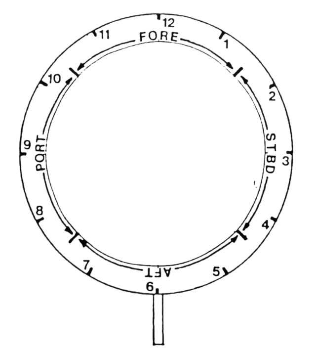
# THE COUNTERS:

A page of sample ship counters is included, so the game is actually playable without models. Photocopy the page several times onto coloured card (if possible), or onto paper to stick to thicker card. Denote different forces by different colours, add an I.D. letter or number to each ship, and you have your fleets!

A slightly more involved (but much more attractive) way of using the counters is to copy each ship twice and stick these copies to two sides of a triangular "prism" of thin card; laid on its third side, this makes an effective "3-D" counter (see diagram below).

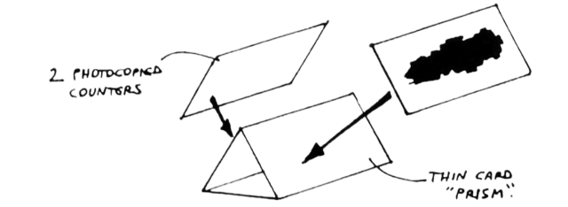

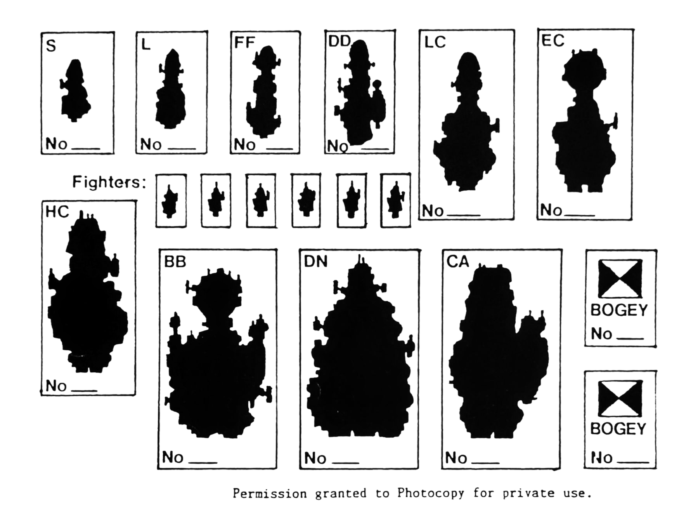
# SHIP MODEL AVAILABILITY:

(Revised and Updated Oct.91)

In the last few months there has been a sudden increase in the available ranges of ship models on the market, including the start of our own GROUND ZERO GAMES range, marketed under the FULL THRUST label: these ships are being produced for us by COPELANDS MODELS, and feature superb detail at reasonable prices. Several of the models are illustrated throughout this rulebook, some being available at the time of writing and others scheduled for release over the coming few months. By early 1992, the range will comprise some 14–15 classes EACH for two different Fleets, plus a selection of support and Merchant craft. All classes covered in these rules will be represented, from individual Fighters to Fleet Carriers, plus more types which can easily be integrated into the systems of the game. There is little point in giving a list of the ranges here, as it is expanding so fast – please send us an SSAE to the address on the back cover for full up-to-date listings.

To move on to other manufacturers, SKYTREX of 28 Brook St., Wymeswold, Loughborough, Leicestershire produce an expanding range under the "STARGUARD" banner; there are three forces available at the time of writing: the Imperial Starguard, the Rigellian Mercenaries and the Rim Raiders, with a fourth (Empire of the Dark Sun) to follow soon. Each "fleet" has six basic ship classes, from Corvette/Frigate sizes to huge Dreadnoughts. The ships vary in design style, and range from £2.95 for 2 of the small craft to £9.95 for the largest. Write to Skytrex at the address above for full details.

IRREGULAR MINIATURES (69A Acomb Road, Holgate, York YO2 4EP), well known for their 1/300 SF vehicles and many other ranges in 6mm and 2mm scale, are just about to release a new range of Starships. I have not seen any samples at the time of writing, but there are to be (at first) 5 "human" and 5 "alien" designs, with hopefully more to follow. Sizes apparently range from about 25mm to 50–60mm in length, at very reasonable prices. Once again, please contact them for more information.

Finally, two VERY old ship ranges that have recently made a reappearance on the market. The first is the ex-Garrison "Startrooper" range, now cast by SKT figures and marketed by NBR Games, 62 Dickens Ave, Corsham, Wiltshire. While this range is showing its age (they were first produced about twelve years ago!) they are still quite acceptable and are VERY reasonably priced – about £2.95 for an 80mm long Battleship! The range is limited, with a total of 11 models divided between 4 different Fleets: ie basically one Escort-size, one Cruiser-size and one Battleship per force, but the prices make large fleets practical on a very limited budget. The other re-release, though many people may not realise it, is part of CITADEL'S "Space Fleet" range; while some of the ships coming out are new designs, a large proportion are actually the ten-year-old QT MODELS "Starforce" fleets, which in their time were just about the best ship models on the market. The moulds were widely rumoured to have been destroyed after Citadel/GW purchased them some years ago, but here they are on the market again! Despite the rather high prices, they are well worth a close look.

There are various other old ranges that may still occasionally turn up on the second-hand market, including the superb US-made VALIANT and SUPERIOR ships, but these are now very rare. Some of the Star Trek-dedicated ranges such as the TASK FORCE GAMES models are still available (ESDEVIUM GAMES in Aldershot have large stocks at the time of writing) and many of these are suitable for pressing into service with other forces. For the older items, have a hunt through the Bring-and-Buy at any Games convention – you never know what you'll find.

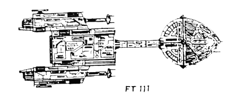

© 1991 J. Tuffley
GROUND ZERO GAMES

------

"FULL THRUST" is a very simple-, quick-play system for large Space Fleet actions, using model Starships or counters. An absolute minimum of equipment is required for play, and this booklet contains a page of copiable ship counters to make up your own fleets at minimal cost!

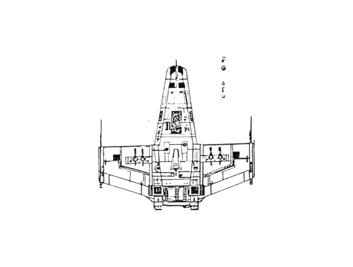

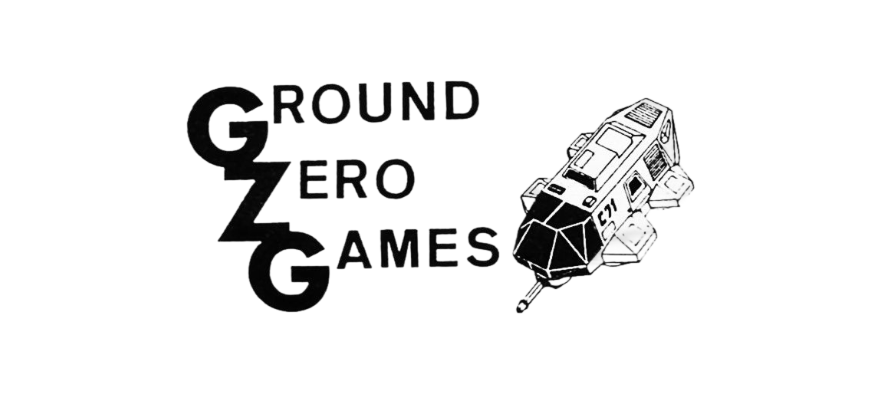

# NOT JUST ANOTHER BUG HUNT ....

---

